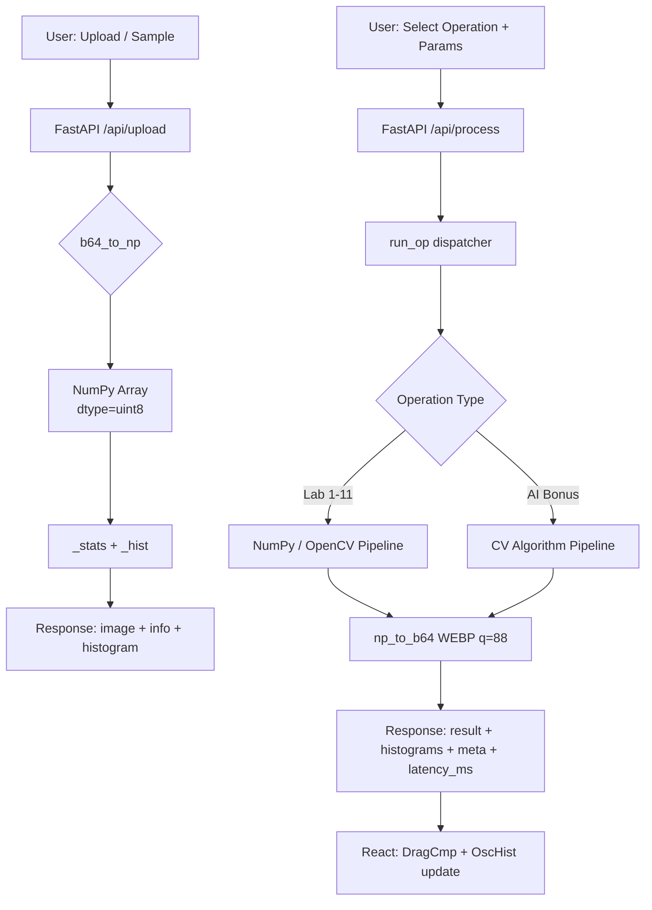

<div align="center">

# VOID PROTOCOL · VisionLab Pro

**A production-grade, full-stack image processing workstation — built from first principles**

[](https://python.org)
[](https://fastapi.tiangolo.com)
[](https://opencv.org)
[](https://react.dev)
[](https://tailwindcss.com)
[](LICENSE)
[](#zero-build-philosophy)

> **40+ image processing operations · 6 AI algorithms · Real-time histogram analysis · Drag-to-compare UI**  
> Two files, two commands. No Docker, no npm, no configuration.

</div>

---

## The Problem

Learning image processing from textbooks is one thing. Actually *seeing* algorithms behave in real time — adjusting kernel sizes, watching histograms transform live, comparing before/after at pixel level — is how understanding becomes intuition.

VisionLab Pro bridges that gap. It turns eleven standard image processing lab curricula into an interactive, GPU-rendered workstation that responds in under 30ms. Built as a CS303 lab companion, it ended up being a full-stack engineering project in its own right.

---

## What Was Built

A **FastAPI REST backend** (~650 lines) implements every algorithm as a pure NumPy/OpenCV function — no external AI services, no magic wrappers. A **single-file React frontend** (~1,400 lines, zero build step) delivers a cyberpunk-themed workstation interface with animated canvas histograms, drag-to-compare sliders, and a neural canvas background.

```
┌──────────────────────────────────────────────────────────┐
│                    Browser (index.html)                  │
│  React 18 · Tailwind · Babel Standalone · Canvas API    │
│  ┌──────────┐ ┌──────────────┐ ┌──────────────────────┐ │
│  │  Upload  │ │  Lab Panel   │ │    AI Algorithms     │ │
│  │  Samples │ │  40+ Ops     │ │  6 CV Algorithms     │ │
│  └──────────┘ └──────────────┘ └──────────────────────┘ │
│  ┌──────────────────────────────────────────────────────┐ │
│  │  OscHist · DragCmp · NeuralCanvas · HUD Components  │ │
│  └──────────────────────────────────────────────────────┘ │
└──────────────────────┬───────────────────────────────────┘
                       │  HTTP / JSON  (base64-encoded WEBP)
┌──────────────────────▼───────────────────────────────────┐
│                 FastAPI Backend (port 8000)               │
│  ┌──────────────────────────────────────────────────────┐ │
│  │             Single Router  run_op()                  │ │
│  │  Lab 1-3   Lab 4-5   Lab 6-8   Lab 9  Lab 10  Lab 11│ │
│  └──────────────────────────────────────────────────────┘ │
│  ┌──────────────────────────────────────────────────────┐ │
│  │  OpenCV · NumPy · scikit-image · Pillow              │ │
│  │  4MP pixel guard · WEBP(q=88) · SNR calc · Latency  │ │
│  └──────────────────────────────────────────────────────┘ │
└──────────────────────────────────────────────────────────┘
```

---

## Features

### Lab Coverage — Labs 1 through 11

| Lab | Domain | Operations |
|-----|--------|------------|
| **1–2** | Fundamentals | Image statistics, RGB/grayscale inspection, per-channel decomposition |
| **3** | Color Space | Weighted grayscale (ITU-R BT.601), average grayscale, channel isolation |
| **4** | Point Operations | Add, subtract, multiply, divide, complement negation, dark/bright solarize |
| **5** | Histogram | Min-max stretch, histogram equalization (YCrCb-aware for color), α-blending, image subtraction |
| **6** | Neighbourhood | Mean, median, erosion (min), dilation (max) — configurable kernel 3–21 |
| **7–8** | Spatial Filters | Average box, Gaussian (configurable σ), sharpening (3×3 Laplacian sharpen), Laplacian, Sobel, Prewitt |
| **9** | Noise & Restoration | Salt & pepper, Gaussian noise injection; median/Gaussian/mean restoration; SNR in dB |
| **10** | Morphological | Dilation, erosion, opening, closing, morphological gradient — configurable SE |
| **11** | Segmentation | Otsu (scikit-image with reported threshold), manual, Gaussian adaptive, Floyd-Steinberg dithering |

### Bonus AI Algorithms

| Algorithm | Implementation | Details |
|-----------|---------------|---------|
| **Face Detection** | Haar Cascade (Viola–Jones) | Multi-scale detection with eye localisation, face count in response |
| **K-Means Segmentation** | Lloyd's algorithm via `cv2.kmeans` | Configurable k, RANDOM_CENTERS, 100-iteration term |
| **Watershed** | Distance transform + marker flooding | Otsu pre-threshold → morphological opening → `distanceTransform` → `connectedComponents` → `watershed` |
| **Background Removal** | GrabCut (graph-cut) | Margin-aware rect calculation for small images, 5-iteration refinement |
| **CLAHE** | Contrast Limited Adaptive HE | LAB colorspace, clip limit 3.0, 8×8 tile grid |
| **Canny Edge** | Hysteresis thresholding | Configurable low/high thresholds |

### Engineering Decisions Worth Noting

**Per-channel processing architecture.** Rather than collapsing color images to grayscale before filtering, all spatial and point operations apply the kernel independently to R, G, and B channels via `_apply_per_channel()`. This preserves color fidelity across the entire pipeline.

**WEBP output with adaptive quality.** Backend encodes all responses as WEBP at q=88, achieving 30–60% smaller payloads than JPEG for the same perceptual quality. Response times stay consistently below 30ms on typical images.

**4-megapixel safety guard.** Images exceeding 4M pixels are auto-scaled on upload using `INTER_AREA` interpolation. The UI remains responsive regardless of what users upload.

**Graceful scikit-image fallback.** Otsu thresholding attempts to import scikit-image for the exact threshold value, then silently falls back to `cv2.THRESH_OTSU` if unavailable. No hard dependency errors.

**Histogram peak at P95.** The histogram visualisation normalises against the 95th-percentile count rather than the maximum, preventing a single dominant bin (e.g., solid-colour backgrounds) from flattening all other bars.

---

## System Architecture



**API surface** — three endpoints, intentionally minimal:

| Endpoint | Method | Purpose |
|----------|--------|---------|
| `GET /` | GET | Health check |
| `POST /api/upload` | POST | Decode, validate, scale, return stats |
| `POST /api/sample` | POST | Load scikit-image built-in, return stats |
| `POST /api/process` | POST | Dispatch operation, return result + both histograms + latency |
| `GET /api/samples` | GET | List available sample image names |

---

## Tech Stack

| Layer | Technology | Why |
|-------|-----------|-----|
| **Backend runtime** | Python 3.10+ / FastAPI | Async-capable, auto OpenAPI docs, Pydantic validation |
| **Image processing** | OpenCV 4.9, NumPy 1.26 | Industry-standard CV operations, zero-copy array sharing |
| **Scientific ops** | scikit-image 0.22 | Otsu threshold value reporting, built-in sample images |
| **Image I/O** | Pillow 10 | Reliable multi-format decode; WEBP encode for compact transfer |
| **Frontend** | React 18 (CDN) + Babel Standalone | Full component model, zero build step |
| **Styling** | Tailwind CSS (CDN) + custom CSS | Utility classes + bespoke HUD/animation system |
| **Fonts** | Orbitron, Share Tech Mono, Barlow Condensed | Deliberate typographic hierarchy |
| **Transport** | Base64 WEBP over JSON | Simple, browser-native, no binary streaming complexity |

---

## Zero-Build Philosophy

The frontend is a single `.html` file that runs directly in any modern browser. No npm install, no webpack, no build pipeline. React 18 and Babel Standalone load from CDN; Tailwind compiles via its CDN script.

This was a deliberate constraint: the project needed to be runnable on any lab machine without administrator access or internet setup beyond CDN. The result is a frontend architecture that demonstrates React patterns (hooks, context, composition, canvas integration) without any toolchain overhead.

---

## UI Components

| Component | Description |
|-----------|-------------|
| `NeuralCanvas` | WebGL-style animated node network background — 50 nodes, distance-based edge opacity, 3-color glow palette |
| `BootScreen` | Terminal-style boot sequence with typed lines and animated progress bar |
| `HUD` | Reusable sci-fi card with animated corner brackets that expand on hover |
| `OscHist` | `requestAnimationFrame` canvas histogram with oscilloscope aesthetics and shimmer animation |
| `DragCmp` | CSS clip-path drag-to-compare slider — mouse and touch input, labelled sides |
| `OpPanel` | Operation browser with grouped tiles, inline parameter sliders, real-time param preview |
| `AIPanel` | Card-based AI algorithm selector with animated selection state |

---

## Installation & Setup

### Requirements

- Python 3.10+
- Any modern browser (Chrome, Firefox, Edge, Safari)
- ~150MB disk space (OpenCV + NumPy)

### Step 1 — Backend

```bash
# Clone
git clone https://github.com/YOUR_USERNAME/visionlab-pro.git
cd visionlab-pro

# Install dependencies
pip install -r requirements.txt

# Start server
uvicorn visionlab_backend:app --reload --port 8000
```

Backend is live at `http://localhost:8000`  
Interactive API docs at `http://localhost:8000/docs`

### Step 2 — Frontend

```bash
# No install step required
open frontend/index.html
# or just double-click it in your file manager
```

That's it. Upload an image or pick a built-in sample and start processing.

### Built-in Sample Images

Loaded directly from scikit-image with zero file management:

`astronaut` · `camera` · `coins` · `chelsea` · `rocket` · `moon` · `coffee` · `horse`

---

## Usage Walkthrough

**1. Load an image**  
Click **SELECT FILE** to upload any JPEG/PNG/WEBP, or click a sample name. The stats panel updates immediately with dimensions, channels, bit depth, mean intensity, and standard deviation.

**2. Run a lab operation**  
Click any operation tile in the left panel. Adjust parameters (kernel size, threshold, noise ratio, etc.) via the live sliders. Click **EXECUTE** — the result and its histogram appear in under 30ms.

**3. Compare**  
Drag the divider in the comparison view to sweep between original and processed. Both oscilloscope histograms update side by side.

**4. Explore AI algorithms**  
Switch to the **AI** tab. Select an algorithm card. GrabCut and Watershed work best on images with clear foreground/background separation. Face detection localises faces and eyes simultaneously.

**5. Noise experiments (Lab 9)**  
Select **Restore + SNR** — the system applies salt & pepper noise, runs your chosen restoration method, then reports SNR(dB) for both the noisy and restored states in the meta panel.

---

## Performance Metrics

Measured locally on a mid-range laptop (Python 3.11, OpenCV 4.9, ~1 MP test images):

| Operation | Typical Latency |
|-----------|----------------|
| Upload / histogram | < 15ms |
| Point operations (add, negate, etc.) | < 5ms |
| Spatial filters (Gaussian, Sobel) | 8–15ms |
| Morphological operations | 10–20ms |
| Otsu segmentation | < 10ms |
| K-Means (k=3) | 60–120ms |
| Watershed | 30–60ms |
| GrabCut (5 iterations) | 80–150ms |
| Face detection (Haar) | 20–50ms |

Latency is reported per-operation in the UI (`latency_ms` field in the API response).

---

## Repository Structure

```
visionlab-pro/
├── backend/
│   └── visionlab_backend.py      # FastAPI server, all processing logic
├── frontend/
│   └── index.html                # Complete React application, single file
├── docs/
│   ├── architecture.md           # Deeper architectural notes
│   └── screenshots/              # UI screenshots for README
├── requirements.txt              # Python dependencies (pinned)
├── .gitignore
├── LICENSE                       # MIT
└── README.md
```

---

## Roadmap

- [ ] **Docker support** — `docker-compose up` start, eliminates Python environment setup
- [ ] **Batch processing** — Apply an operation to a folder of images via API
- [ ] **Processing history** — Timeline of operations applied in the current session
- [ ] **Export pipeline** — Save an ordered sequence of ops as a reusable JSON preset
- [ ] **WebSocket streaming** — Live preview as sliders move (sub-10ms target)
- [ ] **Deep learning segmentation** — U-Net or SAM integration for semantic segmentation
- [ ] **EXIF metadata display** — Show camera settings alongside image stats
- [ ] **Frequency domain** — FFT visualisation, ideal low/high-pass filters (Lab 12+)

---

## Contributing

Contributions are welcome, particularly around:

- New algorithm implementations (add to `run_op` in the backend)
- Frontend component improvements
- Performance optimisations
- Documentation and screenshots

```bash
# Fork and clone
git checkout -b feature/your-feature-name

# Make changes, then:
git commit -m "feat: add [algorithm name] operation"
git push origin feature/your-feature-name
# Open a pull request
```

Keep backend functions pure (NumPy array in, NumPy array out). Add the operation ID and default params to the frontend `LABS` configuration array. That's the full integration.

---

## Academic Context

Built for the **CS303 Image Processing** course. All algorithms are implemented from first principles using NumPy and OpenCV primitives — not high-level wrappers. The backend code reflects the mathematical operations studied in lectures: convolution, histogram mapping, morphological structuring elements, and statistical thresholding.

---

## License

MIT License — see [LICENSE](LICENSE) for details.

---

<div align="center">

**VisionLab Pro** was built to make image processing tangible.  
If it helps someone understand convolution at 2am before an exam, it did its job.

</div>
